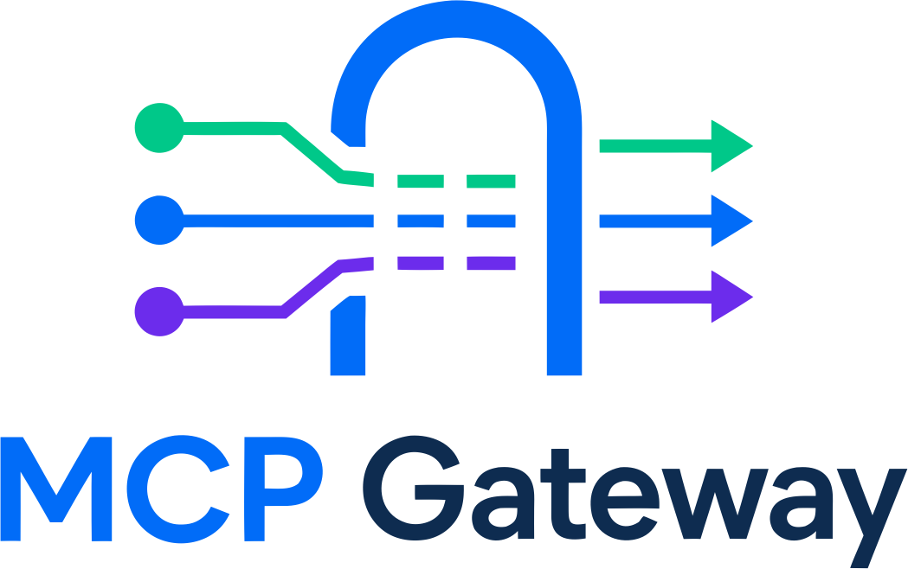

<p align="center">
    
</p>

<p align="center">
    A generic, subclassable Model Context Protocol gateway whose tools are registered and executed
    asynchronously by connected providers over WebSocket.
</p>

<p align="center">
    <code>MCP Client</code> ⇄ Streamable HTTP ⇄ <code>Gateway</code> ⇄ WebSocket ⇄ <code>Provider</code>
</p>

<p align="center">
    <a href="https://github.com/mcp-gtw/mcp-gtw/actions/workflows/ci.yml"></a>
    <a href="https://pypi.org/project/mcp-gtw/"></a>
    <a href="pyproject.toml"></a>
    <a href="LICENSE.md"></a>
</p>

---

The gateway never knows the capabilities ahead of time. A provider — typically a browser app —
connects, publishes its own MCP tools, resources, prompts and more, and executes them when an MCP
client calls them. The gateway only registers, publishes and routes, staying completely domain
agnostic.

It is a small, installable library. You build a real application by **subclassing `Gateway`** and
overriding hooks. The handlers themselves are written in JavaScript. This library never prescribes a
specific frontend — the [Provider SDK](docs/provider-sdk.md) guide teaches the JS side generically.

## 📦 Install

```bash
pip install mcp-gtw
# or
uv add mcp-gtw
```

## 🚀 The smallest gateway

```python
from mcpgtw.gateway import Gateway

app = Gateway().create_app()
```

```bash
uv run python -m mcpgtw.main
```

This publishes a real MCP endpoint at `/mcp`, a private provider WebSocket at `/provider` and a health
check at `/health`. It exposes whatever capabilities the connected provider registers.

## ☁️ One-click deploy

The image runs production-ready as a non-root process. Deploy it to any host that keeps a persistent
server (the `/provider` WebSocket needs one — serverless like Vercel does not work):

[](https://render.com/deploy?repo=https://github.com/mcp-gtw/mcp-gtw)

Render, Railway and Fly.io run the [`Dockerfile`](Dockerfile) as-is (they inject `PORT`, which the
gateway reads); on a VPS (Hostinger, …) use Docker Compose. Full guide, including reverse proxy and
TLS: [deployment](docs/deployment.md).

## 🧩 Extending it

Subclass `Gateway` and override the hooks to attach your own domain logic:

```python
from mcpgtw.channel import Channel
from mcpgtw.gateway import Gateway


class MyGateway(Gateway):
    mcp_server_name = "my-app"

    async def on_provider_connected(
        self, channel: Channel
    ) -> None: ...  # a provider session just came online

    def register_routes(self, app) -> None:
        super().register_routes(app)
        ...  # add your own HTTP and WebSocket routes


app = MyGateway().create_app()
```

Every behaviour is a swappable strategy with a secure default — authentication, tokens, origins,
expiry and the wire codec. Change one by setting a `*_class` attribute or injecting an instance,
without touching the transport. See the [Gateway library](docs/gateway-library.md) guide for every
override point, [Extensibility](docs/extensibility.md) for the strategy contracts, and
[Auth recipes](docs/auth-recipes.md) for token, username/password and client-supplied-token models.

## 📚 Documentation

| Guide | What it covers |
| --- | --- |
| [Architecture](docs/architecture.md) | Components, transports and request flows. |
| [Quick start](docs/quickstart.md) | Install, run and connect an MCP client. |
| [Gateway library](docs/gateway-library.md) | The `Gateway` class and every override point. |
| [Extensibility](docs/extensibility.md) | The swappable strategies, their contracts and the invariants. |
| [Auth recipes](docs/auth-recipes.md) | Token, username/password and client-supplied-token models. |
| [Configuration](docs/configuration.md) | Every setting and environment variable. |
| [Provider protocol](docs/provider-protocol.md) | The private gateway ⇄ provider message protocol. |
| [Provider SDK](docs/provider-sdk.md) | Writing the JavaScript provider and registering tools. |
| [Browser console](docs/browser-console.md) | Turn any open page into a provider from DevTools. |
| [MCP clients](docs/mcp-clients.md) | Connecting Claude Code, generic clients and the Inspector. |
| [Admin dashboard](docs/admin.md) | The optional monitoring dashboard and its stats API. |
| [Security](docs/security.md) | The security model, tokens, origins and hardening. |
| [Testing](docs/testing.md) | Running the suite and the 100% coverage gate. |
| [Deployment](docs/deployment.md) | Docker, reverse proxies and scaling. |

## 🗂️ Layout

```text
.
├── src/mcpgtw/     # the library
├── tests/               # unit and integration tests (100% coverage)
└── docs/                # the guides linked above
```

## ✅ Requirements

- Python 3.12+ — tested on 3.12, 3.13 and 3.14 in CI (3.12 is the pinned local version; Docker uses 3.14)
- Any MCP client (Claude Code, Cursor, the MCP Inspector, …)

## 💜 Support

If this project saved you time, consider supporting it:
[GitHub Sponsors](https://github.com/sponsors/paulocoutinhox) · [Ko-fi](https://ko-fi.com/paulocoutinho).

Made with care by [Paulo Coutinho](https://github.com/paulocoutinhox).

Licensed under [MIT](LICENSE.md).

## OAuth client authorization

Public MCP OAuth is opt-in and requires explicit channel grants. Provider WebSocket credentials remain separate. See [OAuth configuration, extension contracts, transport gates and deployment limits](docs/oauth.md). Embedded OAuth requires an injected durable authorization server; the demo game supplies local account login and consent, including client-initiated authorization before browser login.

Embedded consent permits the validated client callback through its form security policy, including
cross-origin clients. Real-browser approval, denial and tampered-destination tests run in CI and
before publication. See [browser verification](docs/testing.md#oauth-client-authorization).

MCP clients start authorization from the MCP endpoint through discovery. Embedded login and consent
use responsive pages with compact field hints and expandable connection details.

Embedded login and consent allow ten minutes by default, independently of the short-lived
authorization code. Account creation is only offered when the identity strategy enables it.

The [detailed OAuth acceptance checklist](docs/oauth-implementation-checklist.md) tracks protocol,
security, game, SDK, host and upgrade evidence. Local verification and external host checks are
reported separately. The [OAuth strategy contracts](docs/oauth.md#strategy-contracts) describe the
final extension API, including read-only consent validation and scope-bearing grants.
