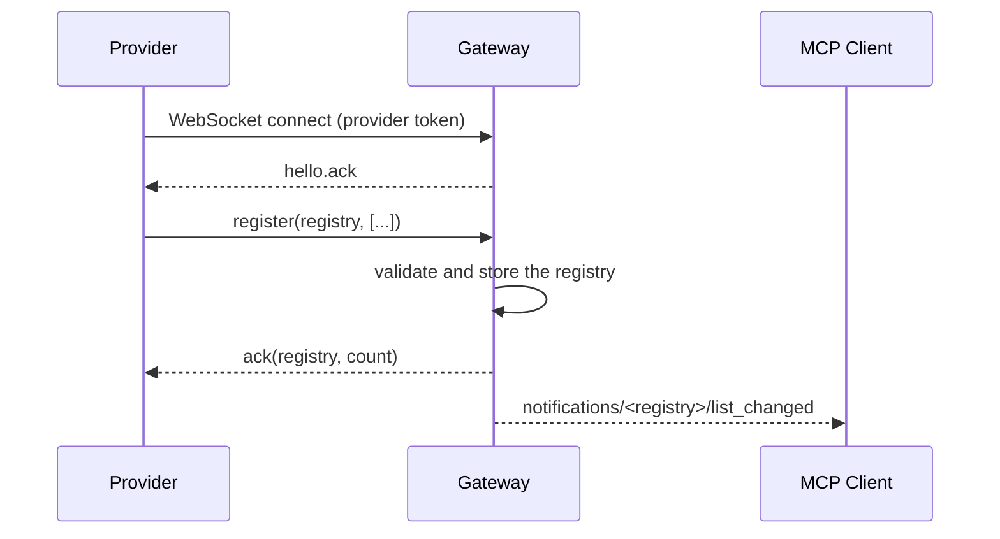
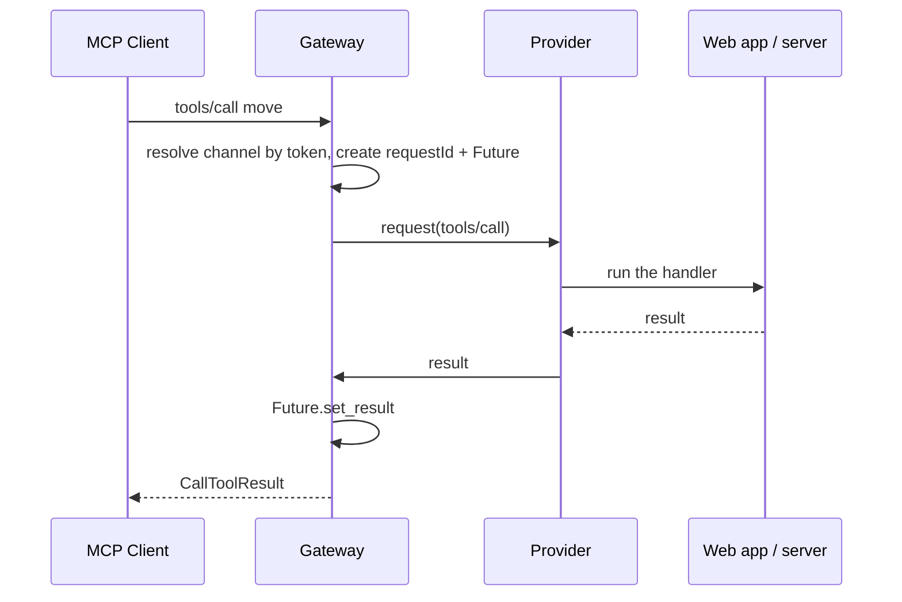

# Architecture

The gateway exposes a real, standard MCP endpoint over Streamable HTTP. The capabilities published on
that endpoint — tools, resources, resource templates, prompts, and completion, plus logging,
progress, sampling and elicitation — are not defined in Python. They are registered at runtime by a
connected provider over a private WebSocket, and executed there too. The gateway is the relay in the
middle.

## Components

| Component | Role |
| --- | --- |
| **MCP client** | Any MCP host (Claude Code, Cursor, the Inspector). Talks Streamable HTTP. |
| **Gateway** | Publishes `/mcp`, accepts providers on `/provider`, routes calls between them. |
| **Channel** | One session: one provider, its registries (tools, resources, templates, prompts) and its pending calls. |
| **Registry** | Owns every channel and resolves the two tokens (client side and provider side). |
| **Provider** | A web app (a browser or any WebSocket client) that registers MCP capabilities and runs their handlers. |
| **Extension** | Optional domain logic built on top of the library by subclassing `Gateway`. |

Two transports are involved, and only one of them is public:

```text
Public, standard:     MCP Client  ⇄  Streamable HTTP  ⇄  Gateway
Private, internal:    Gateway     ⇄  WebSocket        ⇄  Provider
```

The WebSocket is never exposed to MCP clients. It carries a small private protocol
(see [provider protocol](provider-protocol.md)) for capability registration and execution only.

## Request flows

### Registering capabilities



### Executing a tool



## Multi-session by token

A single low-level MCP `Server` and a single `StreamableHTTPSessionManager` serve **every** channel.
The channel is resolved per request from the `Authorization: Bearer <token>` header:

- The `mcp_asgi` wrapper in [`gateway.py`](../src/mcp_gtw/gateway.py) authenticates the token,
  resolves the channel and stashes its id on the ASGI scope.
- The `list_tools` / `call_tool` handlers read that id back with `channel_for_scope` and act on the
  right channel.

Because the low-level server keeps a single global tool cache, per-request input validation is done
in the channel (`validate_input=False` on the server), so every channel validates against its own
schemas. This keeps one process able to serve thousands of independent sessions.

## Many services, one gateway

Every connected provider is its own **service** with its own tools — think of each channel as a
distinct MCP server behind the same gateway. A client reaches the right service in one of two ways,
and the token is always the authority:

- **Token only:** `POST /mcp` with `Authorization: Bearer <mcp_token>`. The token resolves to exactly
  one channel.
- **Addressed:** `POST /mcp/<channel_id>` with the same header. The path is a routing hint, and the
  gateway rejects the request with `404` if the token does not belong to that channel. This gives
  each service a distinct, shareable URL while keeping the token as the only credential.

Because the channel id is public and the token is secret, the path can never be used to reach a
service the caller is not already authorized for.

## Why the provider is more than a UI

The provider is both a **tool provider** (it decides which tools exist and their schemas) and a
**remote worker** (it runs the handlers). When the provider should not be the source of truth — a
competitive multi-user domain, for instance — the handlers forward each call to an authoritative
server that owns the state. The gateway itself stays domain agnostic either way.

## Where to go next

- [Gateway library](gateway-library.md) — the `Gateway` class and how to extend it.
- [Provider SDK](provider-sdk.md) — writing the JavaScript side.
- [Security](security.md) — the trust boundaries drawn above.
